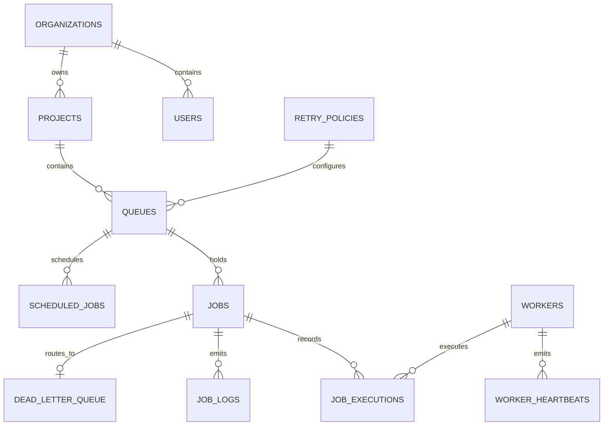

# 📊 Database Entity Relationship & Indexing Model

---

## Schema Design & Relational Invariants

### 1. Multi-Tenant Organizational Hierarchy
* **`organizations` ➔ `projects` ➔ `queues` ➔ `jobs`**: Cascading foreign keys (`ON DELETE CASCADE`) guarantee that deleting a project or organization cleanly purges child queues, jobs, logs, and DLQ entries without leaving orphaned rows.
* **Role-Based Users**: Users belong to an organization and carry a role (`ADMIN`, `MEMBER`, or `SERVICE`).

### 2. Execution Records & Observability
* **`job_executions`**: Tracks individual attempt records per job with references to the worker ID, attempt number, status (`RUNNING`, `COMPLETED`, `FAILED`, `DEAD_LETTER`), start timestamp, finish timestamp, and execution duration in milliseconds.
* **`job_logs`**: Structured event logs captured across execution lifecycles.
* **`worker_heartbeats`**: Historical telemetry of worker CPU load, memory utilization, and in-flight job concurrency recorded every 5 seconds.

### 3. Critical Production Indexes

| Index Name | Table | Indexed Columns | Purpose |
|---|---|---|---|
| `idx_jobs_idempotency` | `jobs` | `(queue_id, idempotency_key)` | Unique partial index preventing duplicate submissions per queue when `idempotency_key` is provided. |
| `idx_jobs_claim_covering` | `jobs` | `(status, scheduled_for, priority DESC, created_at ASC)` | Partial covering index optimizing high-throughput `FOR UPDATE SKIP LOCKED` atomic worker claims. |
| `idx_jobs_queue_active` | `jobs` | `(queue_id)` | Partial index on `status IN ('CLAIMED', 'RUNNING')` for instant queue concurrency limit calculations. |
| `idx_worker_heartbeat_status` | `workers` | `(last_heartbeat, status)` | Powers the background crash-recovery reaper to find stale workers (`> 30s`) without table scans. |
| `idx_scheduled_jobs_due` | `scheduled_jobs` | `(is_active, next_run_at)` | Partial index accelerating recurring cron job discovery. |