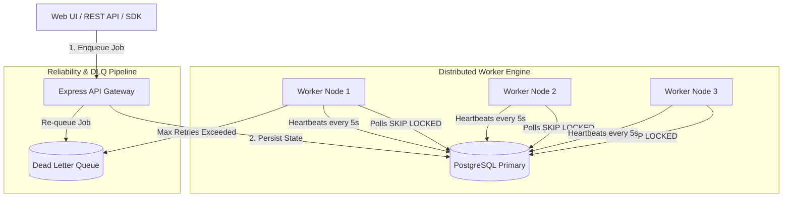
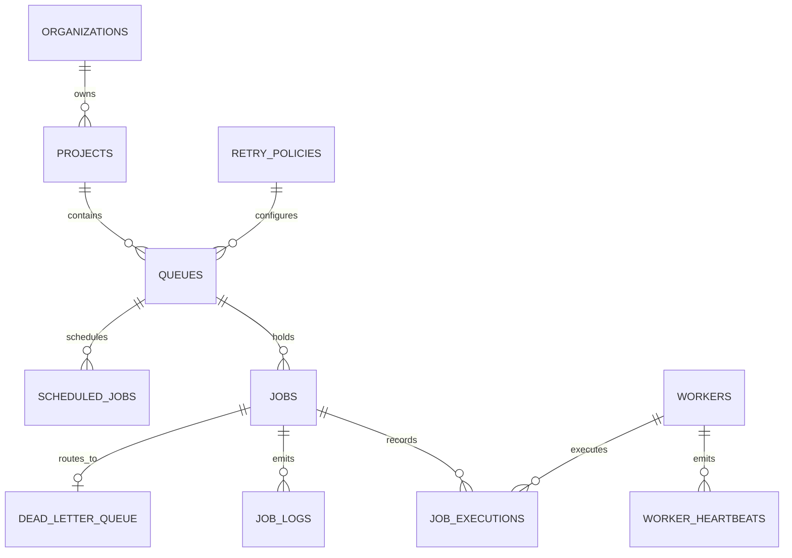

# ⚡ Distributed Job Scheduler Platform

A production-grade distributed job scheduling and asynchronous execution engine built with **Node.js (TypeScript)** and **PostgreSQL**. Features atomic job claiming (`FOR UPDATE SKIP LOCKED`), concurrency isolation, worker heartbeats, exponential backoff retries, Dead Letter Queue (DLQ) routing, and a real-time web dashboard.

---

## 🏛️ System Architecture



---

## 📊 Entity Relationship (ER) Diagram



---

## ⚙️ Core Technical Features & Design Decisions

### 1. Atomic Job Claiming Without Race Conditions
* **Mechanism:** Uses PostgreSQL's row-level locking via `SELECT ... FOR UPDATE SKIP LOCKED`.
* **Trade-off:** Eliminates dual-state sync overhead and cache invalidation risks of separate message brokers (e.g. Redis/RabbitMQ), maintaining strict ACID guarantees and zero duplicate claims.

### 2. Job Lifecycle State Machine
* `QUEUED` ➔ `CLAIMED` ➔ `RUNNING` ➔ `COMPLETED` / `FAILED` ➔ `DEAD_LETTER`
* Immediate jobs enter as `QUEUED`. Delayed jobs enter as `SCHEDULED` with a future `scheduled_for` timestamp.

### 3. Configurable Retry & Backoff Strategy
* **Exponential Backoff Formula:** Delay = min(max_delay, base_delay * 2^attempt)
* Prevents downstream thundering herd scenarios during intermittent service outages.

### 4. Fault Detection & Worker Heartbeats
* Workers update heartbeats every 5 seconds in the `workers` table.
* Stalled or orphaned jobs from dead workers are safely identified when `last_heartbeat < NOW() - INTERVAL '30 seconds'`.

---

## 🚀 Setup & Execution Guide

### Prerequisites
* Node.js (v18+)
* PostgreSQL Database URL (Neon or Local)

### Installation
```bash
git clone https://github.com/arkrrish006-glitch/distributed-job-scheduler.git
cd distributed-job-scheduler
npm install
```

### Environment Configuration
Create a `.env` file in the root directory:
```env
PORT=3000
DATABASE_URL=postgresql://<user>:<password>@<host>/<database>?sslmode=require
```

### Database Initialization
Run `schema.sql` in your PostgreSQL query editor.

### Running the Services
1. **Start the API Server & Web UI:**
   ```bash
   npx tsx src/api/server.ts
   ```
2. **Start the Distributed Worker Node:**
   ```bash
   npx tsx src/worker/worker.ts
   ```
3. **Open Dashboard:** Navigate to `http://localhost:3000`

---

## 🧪 Automated Testing
Run the automated concurrency and DLQ validation suite:
```bash
npx tsx test.ts
```

---

## 📡 REST API Reference

| Method | Endpoint | Description |
|---|---|---|
| `GET` | `/api/queues` | List all active queues |
| `POST` | `/api/queues` | Create a new queue |
| `GET` | `/api/jobs` | Fetch job history and execution states |
| `POST` | `/api/jobs` | Submit an immediate or delayed job |
| `GET` | `/api/workers` | Monitor real-time worker health |
| `GET` | `/api/metrics` | Aggregated throughput and failure metrics |
| `POST` | `/api/dlq/:job_id/retry` | Re-queue a failed DLQ job |